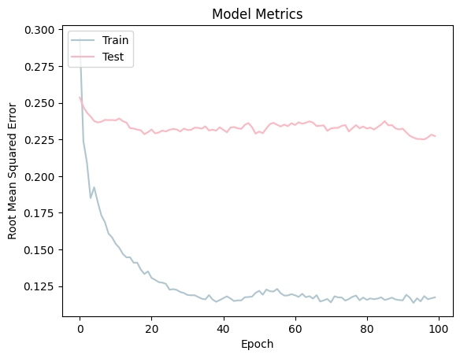

# 📊 Laporan Proyek Rekomendasi Cellphone

## Project Overview

### Latar Belakang

Sistem rekomendasi telah berkembang menjadi alat penting di berbagai industri, termasuk e-commerce, di mana mereka membantu pengguna menemukan produk yang sesuai dengan preferensi pribadi mereka. Dalam konteks ponsel, banyaknya pilihan model dengan spesifikasi yang beragam sering kali membuat pengguna kesulitan dalam membuat keputusan. Oleh karena itu, sistem rekomendasi yang efektif dapat mempermudah proses pemilihan ponsel yang tepat dengan mempertimbangkan kebutuhan dan preferensi individu. Sistem rekomendasi ini umumnya menggunakan teknik seperti collaborative filtering, yang memanfaatkan data interaksi pengguna lain, dan content-based filtering, yang berbasis pada deskripsi produk itu sendiri.

Namun, tantangan utama dalam pengembangan sistem rekomendasi adalah mengatasi masalah kekosongan data, di mana tidak semua pengguna memberikan rating untuk setiap item, serta menangani keanekaragaman kebutuhan pengguna yang berbeda. Kombinasi kedua metode tersebut dalam pendekatan hybrid dapat meningkatkan akurasi dan relevansi rekomendasi.[1] Proyek ini bertujuan untuk membangun sistem rekomendasi ponsel yang dapat memberikan saran yang lebih personal dan relevan, mengatasi masalah data yang tidak lengkap dan menghasilkan rekomendasi yang lebih sesuai dengan preferensi pengguna.

**Pentingnya Proyek** 🤔

Proyek ini memiliki peranan penting karena:
1. Peningkatan Pengalaman Pengguna: Mempermudah pengguna dalam menemukan ponsel yang sesuai dengan preferensi mereka, sehingga meningkatkan kepuasan dan kualitas pengalaman pengguna.
2. Efisiensi: Menghemat waktu dan usaha pengguna dalam proses pencarian serta perbandingan berbagai model ponsel.
3. Personalisasi: Menyediakan rekomendasi yang disesuaikan dengan preferensi individu berdasarkan data penilaian pengguna.

## Business Understanding

### Problem Statements
- Bagaimana kita dapat membantu pengguna menemukan ponsel yang paling cocok dengan kebutuhan dan preferensi mereka?
- Bagaimana kita dapat membantu pengguna menemukan ponsel yang serupa dengan ponsel lama mereka, meskipun mereka tidak memahami spesifikasi teknis ponsel tersebut?

### Tujuan 
- Membangun sistem rekomendasi yang dapat menyajikan daftar ponsel terbaik sesuai dengan preferensi pengguna
- Mengembangkan sistem rekomendasi yang dapat memberikan daftar ponsel terbaik berdasarkan model ponsel lama pengguna (misalnya: iPhone 13).

### Solution statements 💡
- **Content-Based Filtering**: Mengandalkan fitur deskriptif ponsel (seperti merek, model, dan sistem operasi) untuk memberikan rekomendasi yang relevan.
- **Collaborative Filtering**: Memanfaatkan data rating dari pengguna untuk memberikan rekomendasi berdasarkan kesamaan preferensi dengan pengguna lain.

## 📂 Data Understanding 
Dataset yang digunakan mencakup informasi tentang berbagai model ponsel, seperti merek, model, sistem operasi, serta beberapa fitur lainnya. Dataset ini berasal dari [kaggle](https://www.kaggle.com/datasets/meirnizri/cellphones-recommendations/data).
    - Dataset terbagi menjadi 3 yaitu cellphones data, cellphones rating, dan cellphones users.
    - Data ponsel terdiri dari 33 baris dan 32 kolom tanpa adanya nilai yang hilang. 
    
Dataset ini memuat spesifikasi rinci dari setiap ponsel, berikut adalah informasi:

|   Column           |  Dtype   |
|--------------------|----------|
| cellphone_id       | int64    |
| brand              | object   |
| model              | object   |
| operating system   | object   |
| internal memory    | int64    |
| RAM                | int64    |
| performance        | float64  |
| main camera        | int64    |
| selfie camera      | int64    |
| battery size       | int64    |
| screen size        | float64  |
| weight             | int64    |
| price              | int64    |
| release date       | object   |

Berikut adalah contoh data dari dataset cellphone:

| user_id | cellphone_id | rating | brand   | model      | operating system | internal memory | RAM | performance | main camera | selfie camera | battery size | screen size | weight | price | release date |
|---------|--------------|--------|---------|------------|------------------|-----------------|-----|-------------|-------------|---------------|--------------|-------------|--------|-------|--------------|
| 1       | 0            | 5      | Apple   | iPhone XR  | ios              | 64              | 3   | 4.22        | 12          | 7             | 2942         | 6.1         | 194    | 236   | 26/10/2018   |
| 2       | 0            | 10     | Samsung | Galaxy S22 | Android          | 128             | 8   | 8.81        | 50          | 10            | 3700         | 6.1         | 167    | 528   | 25/02/2022   |

*****************************************************************
Cellphones rating terdiri dari 990 baris dan 3 kolom tanpa adanya missing value. Dataset ini berisi nilai rating yang diberikan oleh pengguna X untuk ponsel Y, berikut adalah informasi dari cellphones rating:

|   Column           |  Dtype   |
|--------------------|----------|
| user_id            | int64    |
| cellphone_id       | int64    |
| rating             | int64    |

Berikut adalah contoh data dari cellphones rating:

|index|user\_id|cellphone\_id|rating|
|---|---|---|---|
|0|2|10|9|
|1|0|5|3|

*****************************************************************

Cellphones users terdiri dari 99 baris dan 4 kolom tanpa adanya missing value. Dataset ini berisi informasi tentang pengguna, berikut adalah informasi data dari cellphones users:

|   Column           |  Dtype   |
|--------------------|----------|
| user_id            | int64    |
| age                | int64    |
| gender             | object   |
| occupation         | object   |

Berikut adalah contoh data dari cellphones users:

|index|user\_id|age|gender|occupation|
|---|---|---|---|---|
|0|0|38|Female|Data analyst|
|1|2|55|Female|IT|

#### Variabel dalam dataset
Berikut adalah variabel-variabel yang terdapat dalam dataset:
- data:
  - `cellphone_id`: Unik ID untuk setiap ponsel.
  - `brand`: Merek ponsel.
  - `model`: Model ponsel.
  - `operating system`: Sistem operasi yang digunakan oleh ponsel.
  - `internal memory`: Kapasitas memori internal ponsel dalam GB.
  - `RAM`: Kapasitas RAM ponsel dalam GB.
  - `performance`: Skor kinerja ponsel.
  - `main camera`: Resolusi kamera utama dalam MP.
  - `selfie camera`: Resolusi kamera depan dalam MP.
  - `battery size`: Kapasitas baterai ponsel dalam mAh.
  - `screen size`: Ukuran layar ponsel dalam inci.
  - `weight`: Berat ponsel dalam gram.
  - `price`: Harga ponsel dalam USD.
  - `release date`: Tanggal rilis ponsel.

- rating:
  - `user_id`: Unik ID untuk setiap pengguna.
  - `cellphone_id`: Unik ID untuk setiap ponsel (merujuk pada cellphones_data).
  - `rating`: Nilai rating yang diberikan pengguna untuk ponsel tertentu (skala 1-10).

- users:
  - `user_id`: Unik ID untuk setiap pengguna.
  - `age`: Usia pengguna.
  - `gender`: Jenis kelamin pengguna.
  - `occupation`: Pekerjaan pengguna.

### Exploratory Data Analysis (EDA) 🔍
- Distribusi Brand Ponsel
  
  - Gambar tersebut menunjukkan distribusi jumlah ponsel berdasarkan brand dalam dataset, di mana brand `Samsung` mencatatkan jumlah terbanyak dengan 8 unit, diikuti oleh `Apple` dengan 6 unit. Sementara itu, brand `Asus`, `Oppo`, `Vivo`, dan `Sony` memiliki jumlah ponsel yang lebih sedikit.

- Distribusi Sistem Operasi Ponsel
  
  - Gambar tersebut menunjukkan distribusi sistem operasi pada ponsel dalam dataset, di mana `Android` merupakan sistem operasi yang paling dominan dengan lebih dari 25 unit, sementara `iOS` tercatat memiliki sekitar 6 unit.

- Distribusi Tahun Rilis Ponsel
  
  - Gambar tersebut menunjukkan distribusi ponsel berdasarkan tahun rilis, di mana tahun `2021` dan `2022` mencatatkan jumlah ponsel yang hampir sama, masing-masing lebih dari 15 unit. Sementara itu, tahun `2018` hanya memiliki jumlah ponsel yang sangat sedikit, menunjukkan bahwa dataset lebih dominan pada model-model terbaru.

- Distribusi Rating Ponsel
  
  - Gambar tersebut menunjukkan distribusi rating yang diberikan pengguna untuk ponsel dalam dataset, di mana rating `8 ` merupakan yang paling umum, diikuti oleh rating `7` dan `10`. Rating yang lebih rendah, seperti `2`, `3`, dan `4`, tercatat memiliki jumlah yang lebih sedikit. Secara keseluruhan, sebagian besar ponsel dalam dataset mendapatkan rating yang cukup tinggi, yaitu antara `7` hingga`10`.

## Data Preparation ⚙️

### Teknik Data Preparation
- Menggabungkan seluruh dataset menjadi satu.
- Menangani Missing Values: Menghapus atau mengisi data yang hilang dalam dataset.
- Removing Outliers: Mengeliminasi data dengan nilai outliers pada kolom tertentu.
- Mengubah format penulisan. 
- Mengganti nilai-nilai tertentu.
- Pembagian dataset untuk train-test (80:20).

### Proses Data Preparation
- Menggabungkan dataset `cellphones data`, `cellphones ratings`, dan `cellphones user` menjadi satu dataframe untuk memudahkan analisis dan menghindari fragmentasi data.
- Menghapus nilai Null pada kolom `occupation`agar tidak ada data yang hilang yang dapat memengaruhi hasil analisis dan model.
- Menghapus outlier pada kolom `rating` yang memiliki nilai 18 dan pada kolom `gender` yang memiliki nilai -Select Gender- untuk meningkatkan akurasi model dengan menghilangkan data yang dapat mengganggu kinerja model.
- Mengubah semua nilai pada kolom `occupation` menjadi huruf untuk memastikan konsistensi format penulisan dan mencegah kesalahan interpretasi, di mana nilai yang serupa dapat dianggap berbeda hanya karena perbedaan kapitalisasi.
- Memperbaiki penulisan yang salah pada kolom `occupation`, seperti mengganti nilai 'Healthare' menjadi 'healthcare' dan 'it' menjadi 'information technology', untuk memperbaiki inkonsistensi penulisan yang bisa memengaruhi hasil analisis dan meningkatkan keterbacaan dataset.
- Membagi dataset menjadi train dan test dengan proporsi 80:20 untuk memastikan bahwa model dilatih dengan data yang cukup dan diuji dengan data yang tidak terpengaruh oleh proses pelatihan, memungkinkan evaluasi yang lebih adil terhadap kinerja model.

## Modeling
Pada tahap modeling, akan dibahas dua pendekatan utama yang digunakan dalam pembangunan sistem rekomendasi, yaitu: Content-Based Filtering dan Collaborative Filtering. Penjelasan berikut mencakup parameter yang digunakan, kelebihan dan kekurangan dari masing-masing pendekatan, serta contoh potongan kode yang relevan.

### Model Sistem Rekomendasi Content Based Filtering

Content-Based Filtering memanfaatkan deskripsi dan fitur dari item itu sendiri untuk memberikan rekomendasi. Berikut adalah parameter yang digunakan dalam pendekatan ini:

Tahapan proses:
1.  Karena TF-IDF hanya cocok digunakan untuk data teks, maka hanya kolom dengan tipe data objek yang dipilih.
  ```python
  #dictionary untuk menentukan pasangan key-value
  data_dict = pd.DataFrame({
      'cellphone_id': cellphone_id,
      'brand': brand,
      'model': model,
      'operating_system': operating_system,
  })
  ```

2. Developing a Recommendation System TfidfVectorizer() dengan melakukan perhitungan idf pada data `brand`

3. Melakukan fit lalu ditransformasikan ke bentuk matrix
  ```python
  #fit dan transform ke matriks
  tfidf_matrix = tf.fit_transform(data['brand']) 
  ```
  Hasilnya berupa matriks berukuran (33,10), di mana 33 merujuk pada jumlah data dan 10 adalah jumlah brand.

4. Menghitung similarity degree antar model menggunakan metode cosine similarity.

5. Membuat fungsi model_recommendations .

Bagaimana Algoritma Bekerja:
- Content-Based Filtering menggunakan deskripsi item itu sendiri untuk memberikan rekomendasi. Algoritma ini bekerja dengan cara mengubah fitur deskriptif dari item (seperti model ponsel) menjadi representasi numerik menggunakan TF-IDF Vectorizer. Selanjutnya, dihitung cosine similarity untuk menentukan tingkat kemiripan antara item-item berdasarkan vektor fitur mereka. Berdasarkan hasil perhitungan kemiripan ini, sistem dapat memberikan rekomendasi item yang paling mirip dengan item yang telah disukai oleh pengguna.

Interaksi dengan Sampel Input:
Misalkan pengguna memiliki ponsel "Galaxy S22 Ultra" dan ingin mendapatkan rekomendasi ponsel yang serupa. Algoritma akan:
  1. Mengambil deskripsi lengkap dari "Galaxy S22 Ultra".
  2. Mengubah deskripsi ini menjadi vektor numerik menggunakan TF-IDF Vectorizer.
  3. Menghitung cosine similarity antara vektor "Galaxy S22 Ultra" dan semua vektor ponsel lain dalam dataset.
  4. Mengembalikan daftar ponsel dengan tingkat kemiripan tertinggi terhadap "Galaxy S22 Ultra".

### Top-N Recommendation Content Based Filtering

Menampilkan hasil rekomendasi
  - model_recommendations('Galaxy S22 Ultra')

  |index|model|brand|operating\_system|
  |---|---|---|---|
  |0|Galaxy Z Flip 3 |Samsung|Android|
  |1|Galaxy S22 Plus \(2022\)|Samsung|Android|
  |2|Galaxy Z Fold 3|Samsung|Android|
  |3|Galaxy A32|Samsung|Android|

  - model_recommendations('iPhone 13')

  |index|model|brand|operating\_system|
  |---|---|---|---|
  |0|iPhone 13 Mini|Apple|iOS|
  |1|iPhone SE (2022)|Apple|iOS|
  |2|iPhone XR|Apple|iOS|
  |3|iPhone 13 Pro|Apple|iOS|

### Model Sistem Rekomendasi Collaborative Filtering 

Collaborative Filtering menggunakan interaksi antara pengguna dan item (misalnya rating) untuk menghasilkan rekomendasi. Pada pendekatan ini, kita menggunakan beberapa parameter berikut:

Tahapan proses:
1. Menggunakan dataframe ratings dari file `cellphones ratings.csv`
2. Membuat class `RecommenderNet` mewarisi kelas `Model` Keras:
```python
class RecommenderNet(tf.keras.Model):
  ...
  ...
```
3. Inisialisasi model dengan nilai embedding sebesar 50.
4. Compile model menggunakan:
  - loss = `BinaryCrossentropy`
  - optimizer = `Adam`
  - learning_rate = `0.001`
  - metrics = `RootMeanSquaredError`
5. Melakukan proses training model dengan parameter 
  - batch_size = 8
  - epochs = 100

Bagaimana Algoritma Bekerja:
- Collaborative Filtering menggunakan interaksi antara pengguna dan item (seperti rating) untuk menghasilkan rekomendasi. Algoritma ini berfungsi dengan memprediksi rating untuk item yang belum diulas oleh pengguna, berdasarkan rating yang diberikan oleh pengguna lain untuk item serupa. Model ini mempelajari pola preferensi pengguna dari data rating yang ada, dan menggunakan pola tersebut untuk memberikan rekomendasi item yang kemungkinan besar akan disukai oleh pengguna.

Interaksi dengan Sampel Input:
Misalnya, pengguna dengan ID 10 memiliki beberapa ponsel dengan rating tinggi dan ingin menerima rekomendasi. Algoritma akan:
1. Mengambil data rating dari pengguna lain yang memiliki preferensi serupa.
2. Menggunakan model yang sudah dilatih untuk memprediksi rating untuk ponsel yang belum diulas oleh pengguna 10.
3. Menghasilkan daftar ponsel berdasarkan prediksi rating tertinggi.

### Top-N Recommendation Collaborative Filtering 
```
Showing recommendations for users: 10
===========================
cellphone with high ratings from user
--------------------------------
Vivo : X80 Pro
Apple : iPhone 13 Pro
Apple : iPhone 13 Pro Max
Xiaomi : Poco F4
Samsung : Galaxy Z Fold 3
--------------------------------
Top 10 cellphone recommendation
--------------------------------
Samsung : Galaxy S22
Samsung : Galaxy A53
Oppo : Find X5 Pro
Apple : iPhone 13 Mini
Xiaomi : 11T Pro
OnePlus : 10 Pro
Apple : iPhone SE (2022)
Google : Pixel 6 Pro 
Xiaomi : 12 Pro
Apple : iPhone 13
```
*****************************************************************
*Untuk tahapan proses yang lebih lengkap silahkan baca [Dicoding_ModelSistemRekomendasi.ipynb](https://github.com/alishaanggranidi/recommender-system/blob/main/Recommender_System.ipynb)*
*****************************************************************

## Evaluation
Pada bagian ini, model rekomendasi yang telah dibangun akan dievaluasi menggunakan metrik evaluasi yang sesuai. Untuk model prediksi rating, kami akan menggunakan Root Mean Squared Error (RMSE) sebagai metrik evaluasi. Selain itu, evaluasi juga akan dilakukan untuk menentukan apakah proyek ini berhasil menjawab pernyataan masalah dan memberikan solusi yang diharapkan.

### Metrik Evaluasi 📈

Root Mean Squared Error (RMSE) dalah akar kuadrat dari rata-rata kuadrat selisih antara prediksi dan nilai sebenarnya. Metrik ini menggambarkan sejauh mana prediksi model menyimpang dari nilai yang sebenarnya dalam satuan yang sama dengan variabel yang diprediksi. RMSE sangat berguna karena memberikan penalti yang lebih besar pada kesalahan yang lebih besar.

$$
\text{RMSE} = \sqrt{\frac{1}{n} \sum_{i=1}^{n} (y_i - \hat{y}_i)^2}
$$

Di mana:

  - $y_i$ adalah nilai sebenarnya
  - $\hat y_i$ adalah nilai prediksi
  - $n$ adalah jumlah observasi

- RMSE kecil menunjukkan performa model yang baik karena kesalahan prediksi rendah.
- RMSE besar menunjukkan performa model yang buruk karena kesalahan prediksi tinggi.

## Hasil 


Berdasarkan gambar tersebut RMSE yang dihitung menunjukkan bahwa model prediksi rating memiliki tingkat kesalahan yang dapat diterima, sehingga cukup memadai untuk tujuan rekomendasi.

### Evaluasi Terhadap Business Understanding
Model yang dikembangkan berhasil menjawab problem statement dengan memberikan rekomendasi ponsel berdasarkan model yang ada dan memprediksi rating ponsel yang belum diulas oleh pengguna. Pendekatan content-based filtering memanfaatkan data deskriptif seperti model, brand, dan operating system untuk memberikan rekomendasi ponsel yang relevan, sementara collaborative filtering menggunakan interaksi pengguna-item (rating) untuk menemukan pola preferensi pengguna.

Model content-based filtering menggunakan cosine similarity dan collaborative filtering dengan RecommenderNet berhasil mencapai tujuan untuk memberikan rekomendasi yang relevan. Content-based filtering membuat profil item berdasarkan kesamaan fitur, meningkatkan akurasi rekomendasi, sedangkan collaborative filtering memanfaatkan data rating pengguna untuk memahami preferensi dan memberikan rekomendasi yang sesuai.

Dengan menggunakan kedua algoritma ini, solusi yang direncanakan memberikan dampak positif dalam meningkatkan relevansi dan akurasi rekomendasi. Content-based filtering memastikan rekomendasi yang relevan dengan mempertimbangkan kesamaan fitur, sementara collaborative filtering memungkinkan sistem memahami preferensi pengguna dari interaksi sebelumnya, menghasilkan rekomendasi yang lebih personal. Hasilnya menunjukkan bahwa pendekatan ini berhasil mencapai tujuan proyek dan memberikan rekomendasi yang sesuai dengan kebutuhan pengguna.

## Kesimpulan 👀
Kombinasi kedua pendekatan ini membangun sistem rekomendasi yang lebih kuat dan fleksibel. Content-Based Filtering cocok untuk memberikan rekomendasi berdasarkan fitur item, sementara Collaborative Filtering efektif dalam menemukan pola preferensi pengguna dari data interaksi. Memahami kelebihan dan kekurangan masing-masing pendekatan membantu memilih metode yang tepat sesuai dengan kebutuhan dan konteks sistem rekomendasi yang sedang dibangun.

## Referensi

[1] [Li, M., Wu, Q., Fu, L., Tang, Z., & Banks, D., "Recommender Systems: A Review," Journal of the American Statistical Association, vol. 119, no. 545, pp. 773-785, Nov. 2023.](https://www.researchgate.net/publication/375442432_Recommender_Systems_A_Review/link/660ab75d390c214cfd2f2864/download?_tp=eyJjb250ZXh0Ijp7ImZpcnN0UGFnZSI6InB1YmxpY2F0aW9uIiwicGFnZSI6InB1YmxpY2F0aW9uIn19) 